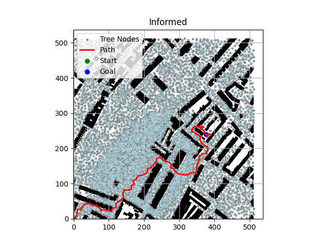
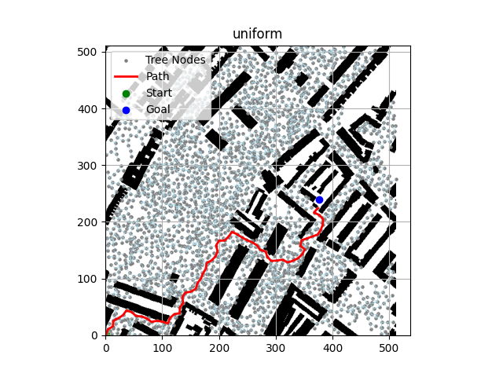
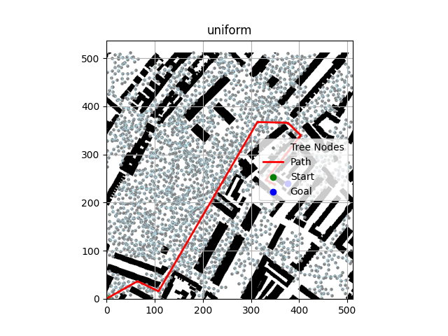

# Rapidly-exploring random trees path planning

This project implements the rapidly-exploring random tree (RRT) algorithm for path planning on a 2D space with obstacles, based on:

- [LaValle, 1998 - Rapidly-exploring random trees: A new tool for path planning](https://msl.cs.illinois.edu/~lavalle/papers/Lav98c.pdf)
- [Karaman & Frazzoli, 2011 - Sampling-based algorithms for optimal motion planning](https://arxiv.org/pdf/1105.1186)

## Table of Contents

- [Requirements](#requirements)
- [Features](#features)
- [Example Outputs](#example-outputs)
- [Usage](#usage)
- [Benchmarker](#benchmarker)


## Requirements

- Python 3.11
- `numpy`, `scipy`, `matplotlib`

## Features

Main algorithm:<br>

- Implements RRT with various sampling techniques
- Fast nearest-neighbor lookup using SciPy’s cKDTree
- Edge validation through Bresenham's line algorithm
- Final path reconstruction via parent pointers
- Path smoothing via shortcutting, maintaining obstacle safety
- Path cost computation using Euclidean distance

Environment:<br>

- 2D grid map, `grid_map` with obstacles determined by binary encoding, where 0 indicates free space and 1 indicates obstacles
- Uses maps based on real world map data from: [movingai](https://movingai.com/benchmarks/grids.html)

Sampling:<br>

- Uniform: Point randomly sampled from free space
- Goal biasing: Goal point is used as the sample point
- Obastacle based: Uniformly samples one point and uses a Gaussian sample around the first point to find the second, the point closest to an obstacle is chosen
- Bridge: Samples two points that are located in distinct obstacles and selects the midpoint
- Far from obstacle: Samples a fixed number of points and selects the point which is farthest from its closest obstacle
- Halton: Samples a point using Halton low-discrepency sequence
- Informed: Uses sampling method based on the paper: [Karaman, S., & Frazzoli, E. (2013). Sampling-based Algorithms for Optimal Motion Planning](https://www.ri.cmu.edu/pub_files/2014/9/TR-2013-JDG003.pdf)

Visualisation:<br>

- Plot displaying: nodes, edges, final path, obstacles, start and end points

Benchmarker:<br>

- Benchmarker class to measure various performance metrics for a given RRT
- Utilises parallesiation to benchmark a RRT in batches
- Currently gives you information on: Success rate, mean path length, mean RRT growth time, mean number of nodes
  
## Example outputs

Below are the two plots for informed sampling and uniform sampling based RRTs

<p align="center">
  
</p>

<p align="center">
  
</p>

Here is also an example of a smoothed uniform RRT plot

<p align="center">
  
</p>

## Usage
To run a demo with a preselected map:
```bash
pip install numpy matplotlib scipy
python main.py
```

## Benchmarker
The `Benchmarker` class evaluates the performance of your RRT implementation using parallelized batch runs.

Metrics collected:
-  Success rate (how often a path to the goal is found)
-  Mean path length
-  Mean time to grow the tree
-  Mean number of nodes in the final tree

Note: Currently supports benchmarking a single sampling method per batch.

  
