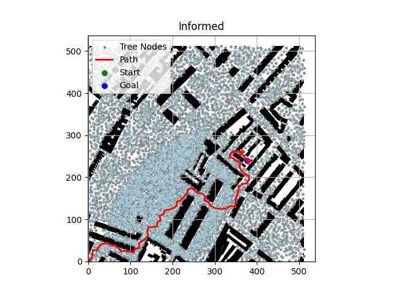
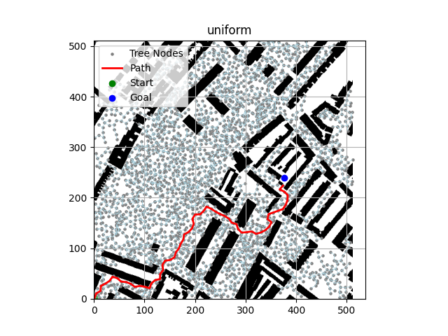
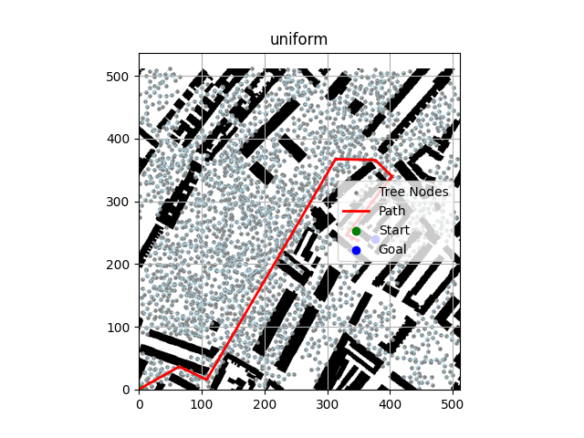

# Rapidly-exploring random trees path planning


This project implements the rapidly-exploring random tree (RRT) algorithm for path planning on a 2D space with obstacles, based on:

- [LaValle, 1998 – Rapidly-exploring random trees: A new tool for path planning](https://msl.cs.illinois.edu/~lavalle/papers/Lav98c.pdf)
- [Karaman & Frazzoli, 2011 – Sampling-based algorithms for optimal motion planning](https://arxiv.org/pdf/1105.1186)

## Table of Contents

- [Requirements](#requirements)
- [Installation](#installation)
- [Usage](#usage)
- [Features](#features)
- [Example Outputs](#example-outputs)
- [Benchmarker](#benchmarker)
- [Project Structure](#project-structure)
- [Development](#development)

## Requirements

- Python 3.11
- [Poetry](https://python-poetry.org/)

## Installation

```bash
git clone https://github.com/Dly27/rapidly-exploring-random-trees.git
cd rapidly-exploring-random-trees
poetry install
```

## Usage

### Grow a tree and get a path

```python
import numpy as np

from grids.grids import load_map
from rrt.RRT import RRT

grid_map = load_map("grids/street-map/London_1_512.map")

rrt = RRT(
    x_init=[1, 1],
    grid_map=grid_map,
    rebuild_freq=500,
    goal=np.array([376, 240]),
    step=10,
)
rrt.select_sampler(sampler_method="uniform", goal_bias=0.05, iterations=50)
rrt.grow(k=5000, r=3)

goal_node = rrt.find_nearest_neighbour(rrt.goal)
path = rrt.get_path(goal_node)
print("Path cost:", rrt.path_cost())
```

For informed sampling:

```python
rrt.informed_grow(k=5000, r=3, limit=10)
```

### Visualise a run

```python
from rrt.plotter import Plotter

Plotter(
    grid_map=grid_map,
    x_init=[1, 1],
    goal=np.array([376, 240]),
    step=10,
    rebuild_freq=500,
    k=5000,
    r=3,
    limit=10,
    sampler_method="uniform",
    goal_bias=0.05,
    iterations=50,
    smooth=False,
    informed=True,
).plot_grid()
```

> **Note:** `rrt/main.py` contains a ready-to-run example.

## Features

**Main algorithm**

- Implements RRT with various sampling techniques
- Fast nearest-neighbour lookup using SciPy's `cKDTree`
- Edge validation through Bresenham's line algorithm
- Final path reconstruction via parent pointers
- Path smoothing via shortcutting, maintaining obstacle safety
- Path cost computation using Euclidean distance

**Environment**

- 2D grid map (`grid_map`) with obstacles as a binary encoding, where `0` is free space and `1` is an obstacle
- Uses maps based on real-world data from [movingai](https://movingai.com/benchmarks/grids.html)

**Sampling methods**

- **Uniform** – point randomly sampled from free space
- **Goal biasing** – returns the goal point with a fixed probability, otherwise samples uniformly
- **Obstacle based** – samples one point, then a Gaussian sample around it; the point closest to an obstacle is chosen
- **Bridge** – samples two points in distinct obstacles and selects the midpoint
- **Far from obstacle** – samples a fixed number of points and selects the one farthest from its closest obstacle
- **Halton** – samples using the Halton low-discrepancy sequence
- **Informed** – ellipsoidal sampling based on [Gammell, Srinivasa & Barfoot, 2013 – Informed RRT\*](https://www.ri.cmu.edu/pub_files/2014/9/TR-2013-JDG003.pdf)

**Visualisation**

- Plot displaying nodes, edges, final path, obstacles, and start/goal points

**Benchmarker**

- `Benchmark` class measuring performance metrics for a given RRT
- Parallelised batch runs
- Reports success rate, mean path length, mean growth time, and mean node count

## Example outputs

Below are the plots for informed and uniform sampling based RRTs.

<p align="center">
  
</p>
<p align="center">
  
</p>

An example of a smoothed uniform RRT plot:

<p align="center">
  
</p>

## Benchmarker

The `Benchmark` class evaluates the performance of your RRT implementation using parallelised batch runs.

```python
from rrt.benchmarker import Benchmark

benchmark = Benchmark(
    grid_map=grid_map,
    x_init=[1, 1],
    goal=np.array([376, 240]),
    step=10,
    rebuild_freq=500,
    k=5000,
    r=3,
    informed=True,
)
benchmark.test(
    sampler_method="uniform",
    goal_bias=0.05,
    sample_iterations=50,
    test_iterations=10,
)
```

Metrics collected:

- Success rate (how often a path to the goal is found)
- Mean path length
- Mean time to grow the tree
- Mean number of nodes in the final tree

> **Note:** Currently supports benchmarking a single sampling method per batch.

## Project Structure

```
rrt/
  grids/
  RRT.py
  sampler.py
  plotter.py
  benchmarker.py
  main.py
tests/
```

## Development

Run the test suite, linter, and type checker:

```bash
poetry run pytest              # tests
poetry run pytest --cov=rrt    # tests with coverage
poetry run ruff check .        # lint
poetry run mypy rrt            # type check
```
